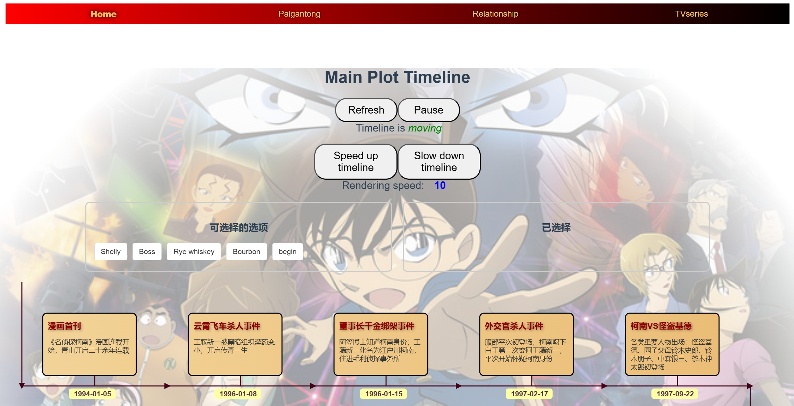

# Conan Visualization

<p align="center">
    
    </p>

Demo has been published on [Bilibili](https://www.bilibili.com/video/BV1g56zYMErv), you are free to check it.

## Recommended IDE Setup

[VSCode](https://code.visualstudio.com/) + [Volar](https://marketplace.visualstudio.com/items?itemName=Vue.volar) (and disable Vetur).

## Customize configuration

See [Vite Configuration Reference](https://vite.dev/config/).

### Compile and Hot-Reload for Development

```sh
npm run dev
```

### Type-Check, Compile and Minify for Production

```sh
npm run build
```

## Acknowledgements
Conan Visualization system is developed by Three students at Zhejiang University, all rights preserved. 